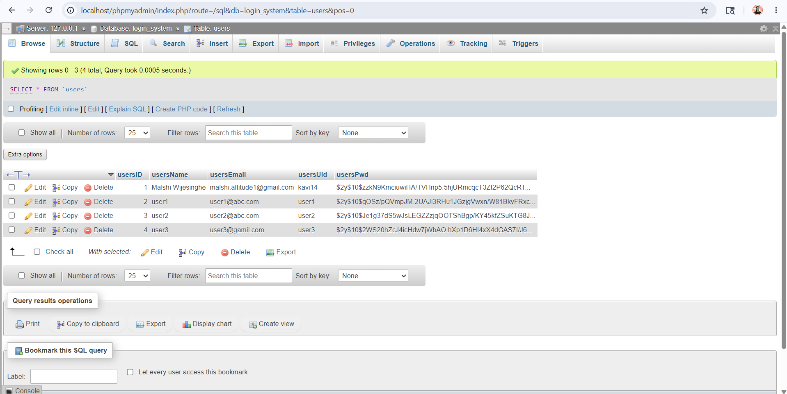
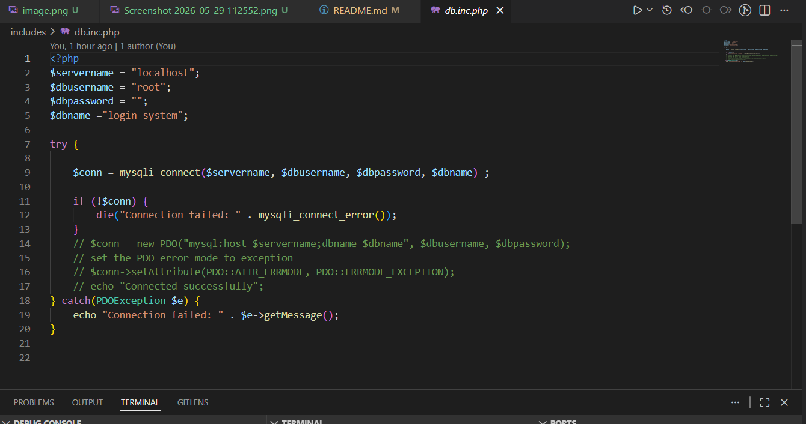
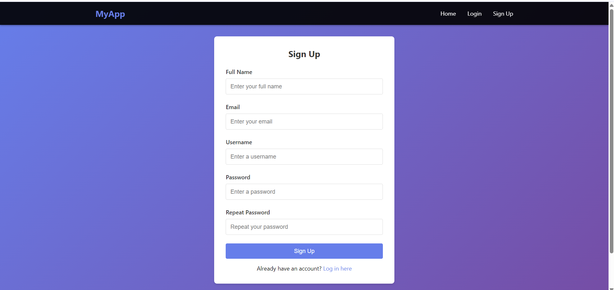
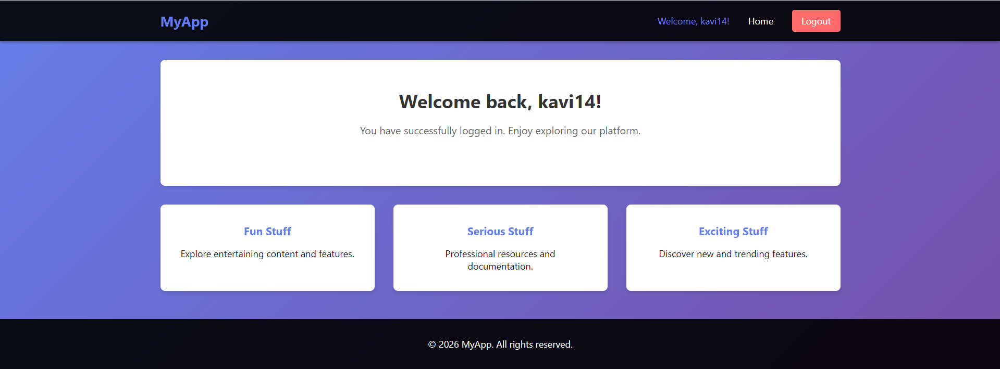
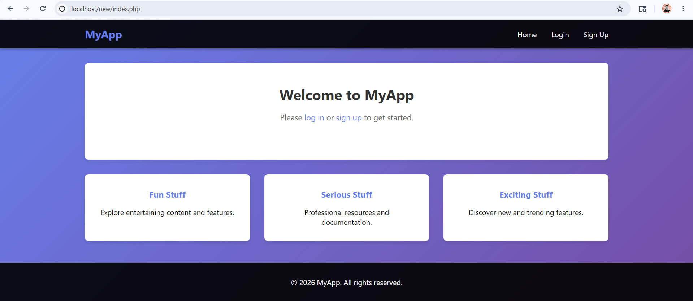

# PHP Secure Login System

## 📋 Project Overview

A secure PHP login and registration system demonstrating essential web development concepts: user authentication, session management, password hashing, input validation, and SQL injection prevention.

**Based on**: [PHP Login System Tutorial - YouTube](https://www.youtube.com/watch?v=gCo6JqGMi30)

---

## ✨ Key Features

✅ **User Registration** - Full name, email, username validation with duplicate prevention  
✅ **Secure Login** - Password verification using bcrypt hashing  
✅ **Session Management** - PHP sessions for persistent authentication  
✅ **Welcome Dashboard** - Personalized greeting for authenticated users  
✅ **Logout** - Session destruction and proper cleanup  
✅ **Security** - SQL injection prevention, input validation, error handling  

---

## 🚀 Quick Start 

### 1. Start Services
```
XAMPP Control Panel → Start Apache → Start MySQL
```

### 2. Create Database
Go to `http://localhost/phpmyadmin/` and create database `login_system`, then run:

```sql
CREATE TABLE users (
    usersId INT AUTO_INCREMENT PRIMARY KEY,
    usersName VARCHAR(128) NOT NULL,
    usersEmail VARCHAR(128) NOT NULL UNIQUE,
    usersUid VARCHAR(128) NOT NULL UNIQUE,
    usersPwd VARCHAR(255) NOT NULL,
    usersDate TIMESTAMP DEFAULT CURRENT_TIMESTAMP
);
```

### 3. Access & Test
- Home: `http://localhost/new/index.php`
- Register: `http://localhost/new/signup.php`
- Login: `http://localhost/new/login.php`

---

## 📁 Project Structure

```
new/
├── index.php              # Welcome/Dashboard (Protected)
├── login.php              # Login form
├── signup.php             # Registration form
├── header.php             # Navigation bar
├── footer.php             # Page footer
├── README.md              # This file
│
└── includes/
    ├── db.inc.php         # Database connection
    ├── functions.inc.php  # Validation functions
    ├── login.inc.php      # Login handler
    ├── signup.inc.php     # Registration handler
    └── logout.inc.php     # Logout handler
```

---

## 🔐 Security Features

### Password Hashing
```php
// Store: Hash password with bcrypt
$hashedPwd = password_hash($pwd, PASSWORD_DEFAULT);

// Verify: Compare user input with hash
$isCorrect = password_verify($userInput, $hashedPwd);
```

### SQL Injection Prevention
```php
// Use prepared statements instead of concatenation
$sql = "SELECT * FROM users WHERE usersUid = ? OR usersEmail = ?";
$stmt = mysqli_stmt_init($conn);
mysqli_stmt_prepare($stmt, $sql);
mysqli_stmt_bind_param($stmt, "ss", $uid, $email);
mysqli_stmt_execute($stmt);
```

### Input Validation
- **Username**: Alphanumeric only (regex: `/^[a-zA-Z0-9]*$/`)
- **Email**: Valid email format (filter_var with FILTER_VALIDATE_EMAIL)
- **Password**: Matches confirmation field
- **All Fields**: Required (no empty inputs)
- **Duplicates**: Username and email must be unique

### Session Management
```php
// Start session after successful login
session_start();
$_SESSION["userid"] = $userId;
$_SESSION["useruid"] = $username;

// Destroy session on logout
session_start();
session_unset();
session_destroy();
```

---

## 📊 Database Schema

| Column | Type | Description |
|--------|------|-------------|
| usersId | INT | Primary key, auto-increment |
| usersName | VARCHAR(128) | User's full name |
| usersEmail | VARCHAR(128) | Unique email address |
| usersUid | VARCHAR(128) | Unique username (alphanumeric) |
| usersPwd | VARCHAR(255) | Bcrypt-hashed password |
| usersDate | TIMESTAMP | Registration date |

---

## 🎯 Usage Workflows

### Registration
1. Go to `http://localhost/new/signup.php`
2. Fill form: Name, Email, Username, Password, Confirm Password
3. System validates all fields and checks duplicates
4. On success: Account created → Redirect to login
5. On error: Show specific error message

### Login
1. Go to `http://localhost/new/login.php`
2. Enter Username and Password
3. System verifies credentials
4. On success: Session created → Redirect to welcome page
5. On error: Show "Wrong login" message

### Welcome Dashboard
- Only shown when logged in (session active)
- Displays personalized greeting: "Welcome back, [username]!"
- Navigation shows "Logout" button
- Access destroyed pages when logout

### Logout
1. Click "Logout" in navigation bar
2. Session destroyed
3. Redirected to home page
4. Navigation returns to "Sign Up" and "Login" links

---

## ⚙️ Configuration

Database credentials in `includes/db.inc.php`:

```php
$servername = "localhost";
$dbusername = "root";      // XAMPP default
$dbpassword = "";          // XAMPP default (empty)
$dbname = "login_system";
```

Modify if using different credentials or remote server.

---

## 🧪 Test Credentials

```
Full Name:  John Doe
Email:      john@example.com
Username:   johndoe
Password:   SecurePass123
```

---

## 🐛 Common Issues & Fixes

| Issue | Fix |
|-------|-----|
| "Connection failed" | Ensure MySQL is running in XAMPP |
| "Username already taken" | Choose different username or email |
| "Passwords don't match" | Verify both password fields are identical |
| "Wrong login" | Check username spelling and password |
| Logout button missing | Verify you're logged in (check session) |
| Blank page | Ensure Apache is running |

---

## 📝 Implementation Details

### Validation Functions (includes/functions.inc.php)

```php
// Check if fields are empty
emptyInputSignup($name, $email, $uid, $pwd, $pwdRepeat)
emptyInputLogin($name, $pwd)

// Validate username format (alphanumeric only)
invalidUid($uid)

// Validate email format
invalidEmail($email)

// Check if passwords match
pwdMatch($pwd, $pwdRepeat)

// Check if username/email already exists
uidExists($conn, $uid, $email)

// Create new user with hashed password
createUser($conn, $name, $email, $uid, $pwd)

// Verify login credentials
loginUser($conn, $name, $pwd)
```

---

## 🎬 Demonstration

### What to Show in Screencast (1-2 minutes)

1. **Registration**
   - Navigate to signup page
   - Fill form with valid data
   - Show success message
   - Verify redirect to login

2. **Login**
   - Enter test credentials
   - Show successful redirect
   - Display welcome page with greeting

3. **Authenticated State**
   - Show username in navigation
   - Show logout button
   - Browse while logged in

4. **Logout**
   - Click logout
   - Show session cleared
   - Show login links reappear


## 📚 Resources

- [PHP Sessions Documentation](https://www.php.net/manual/en/book.session.php)
- [Password Hashing](https://www.php.net/manual/en/function.password-hash.php)
- [MySQLi Prepared Statements](https://www.php.net/manual/en/mysqli.quickstart.prepared-statements.php)
- [OWASP Security Guidelines](https://owasp.org/)
- [YouTube Tutorial](https://www.youtube.com/watch?v=gCo6JqGMi30)


## 📚 Screenshots

(images/Screenshot 2026-05-29 112552.png)





